# BPMonCamunda
BPM implementations on the Camunda Engine (and the Camunda Modeller) using the BPMN 2.0 language; These example implementations are for academic purposes; initially for undergraduate level, but also for graduate level. 

## Index

1. [Description](#description)
2. [Prerequisites](#prerequisites)
    1. [Environment](#environment)
3. [Tool Usage](#Tool-usage)

## Description

Business process implementations are carried out using the Camunda engine, together with the modeler offered by this tool. The main purpose of these implementations is to serve as an educational resource, with the objective of providing a practical and theoretical understanding of process automation. However, they are also adaptable and applicable for graduate programs, where they seek to deepen the analysis and advanced design of business processes, fostering the development of specialized competencies in process management.

## Prerequisites

### Environment

To use any implementation you need the following:

1. **Java 21**: is a versatile and widely used programming language known for its platform independence, robustness, and scalability. With its rich ecosystem of libraries and frameworks, Java enables developers to build complex enterprise-grade applications efficiently and reliably. [this link](https://www.youtube.com/watch?v=oAin-q1oTDw&pp=ygUXY29tbyBjb25maWd1cmFyIGphdmEgMTc%3D)

2. **Camunda Modeler**: is a desktop application that provides a graphical user interface for designing BPMN and DMN diagrams. It allows users to visually model their business processes and decision tables using drag-and-drop elements, making it easy to create, edit, and analyze process models. [official website](https://camunda.com/download/modeler/)
    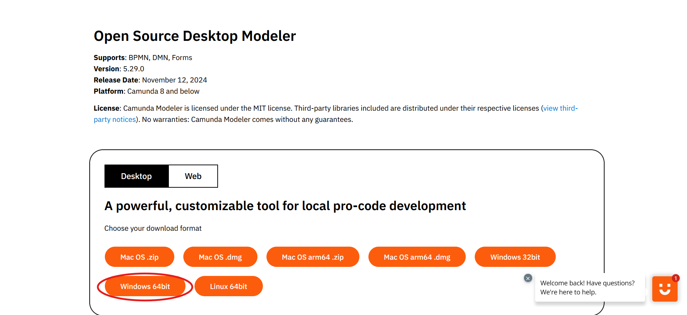

3. **Camunda Run**: is a lightweight, out-of-the-box distribution of the Camunda BPM process engine, designed to facilitate the implementation and execution of BPMN (Business Process Model and Notation) and DMN (Decision Model and Notation) based processes and decisions. [official website](https://camunda.com/download/platform-7/)
    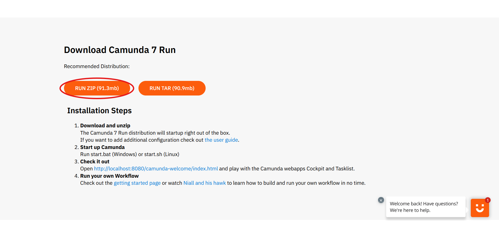

## Tool Usage

To use and deploy any implementation you must:

2. Open any implementation with the ```camunda modeler```.
    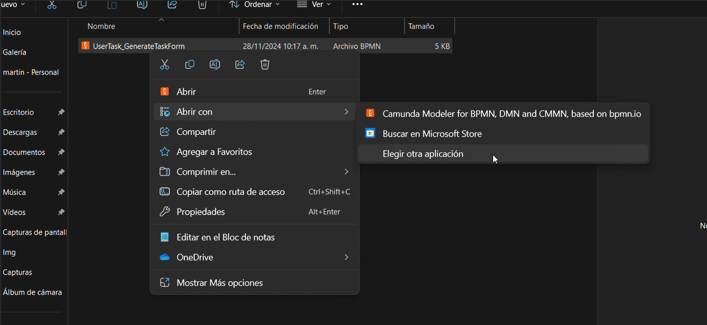
    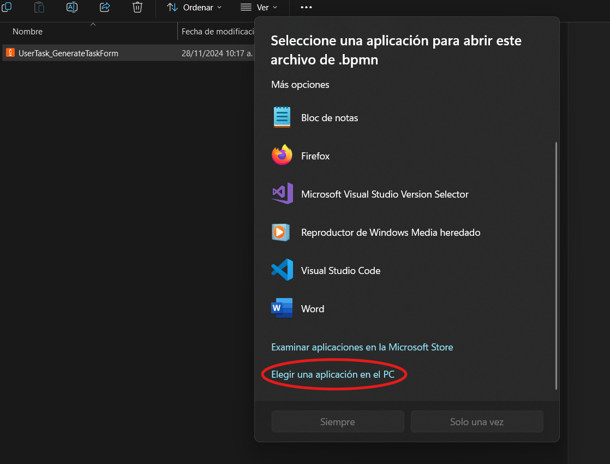
    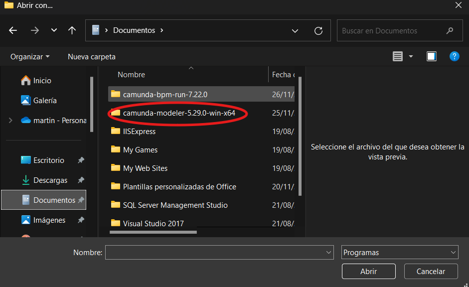
    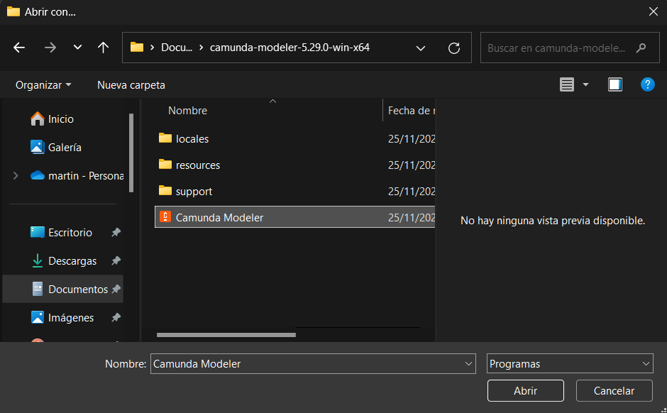
    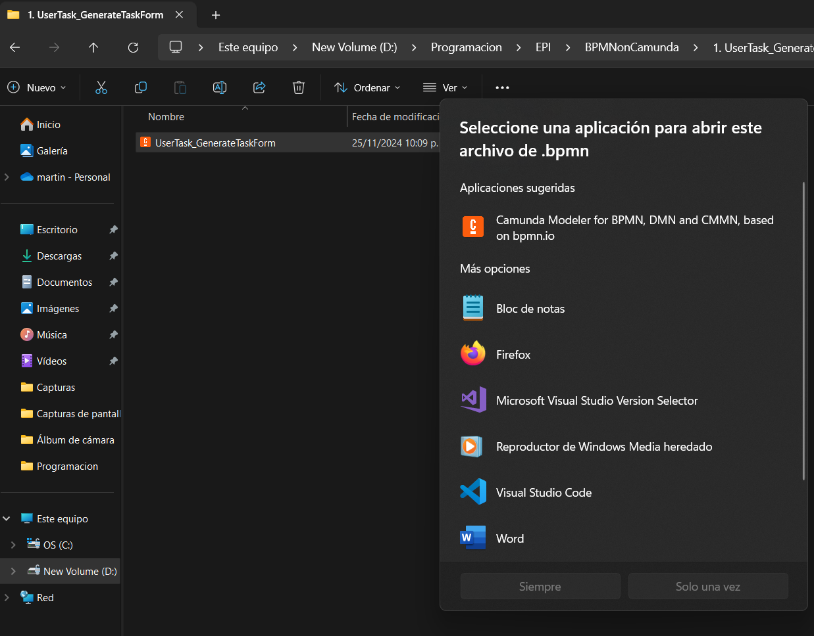

1. Open the folder ```camunda run``` and execute the field ```start.bat```. 
    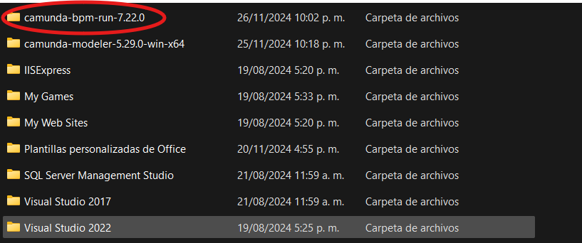
    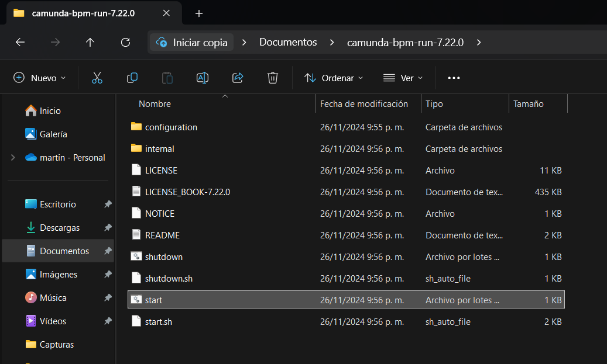

3. Deploy the BPMN, do not forget to add the FORMs or DMNs required by the model.
    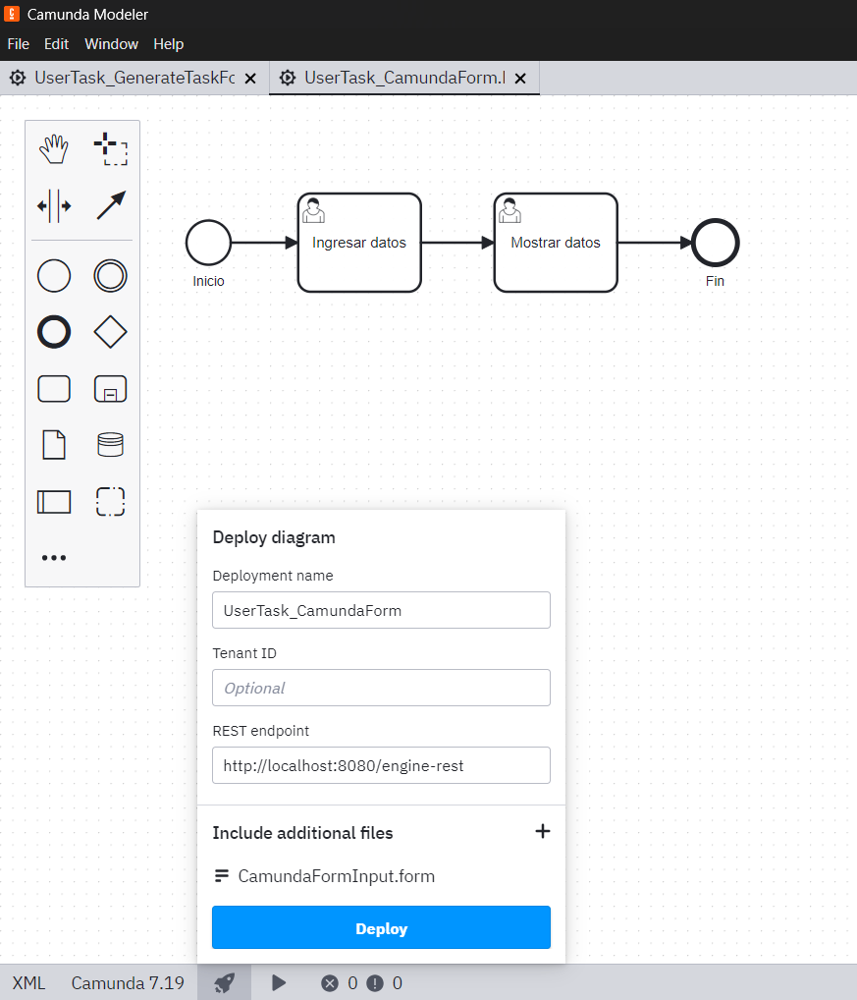

4. From your favorite browser go to ```localhost:8080``` and there log in with user: demo, password: demo.
    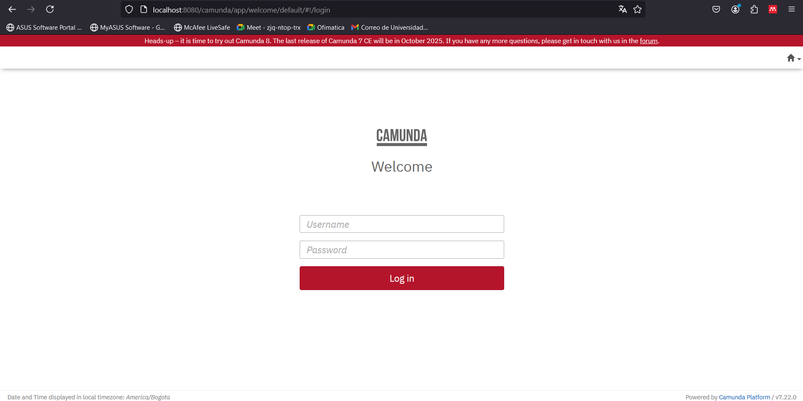

5. After logging in, you can go to the cockpit to view the processes.
    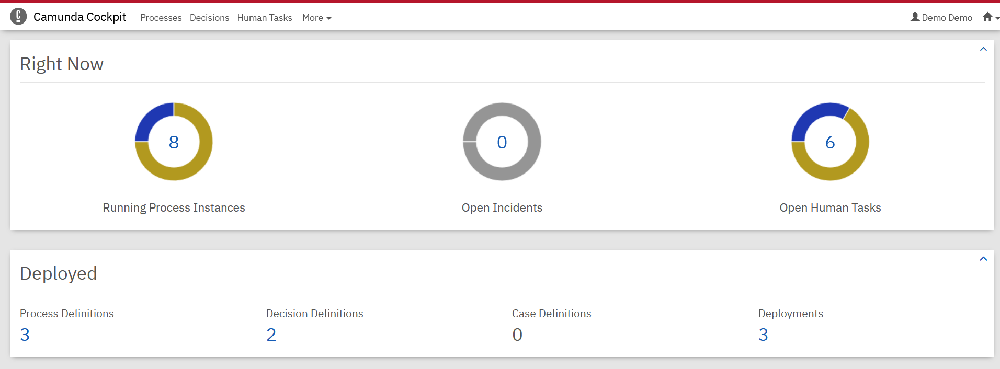

6. To create an instance of the process we must go to ```Tasklist```.
    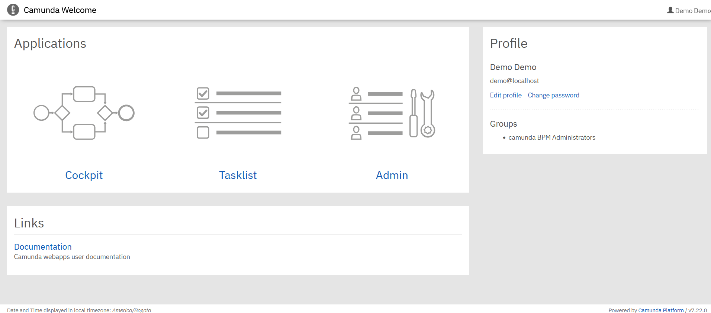

7. Here you can create instances of the process.
    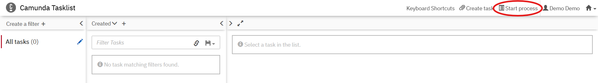

8. When you want to create an instance you must select which process you want to create.
    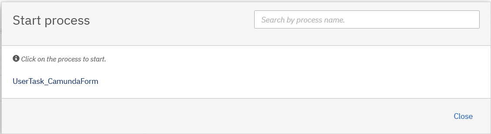

9. In order to be able to enter data in the forms, the instance must be claimed.
    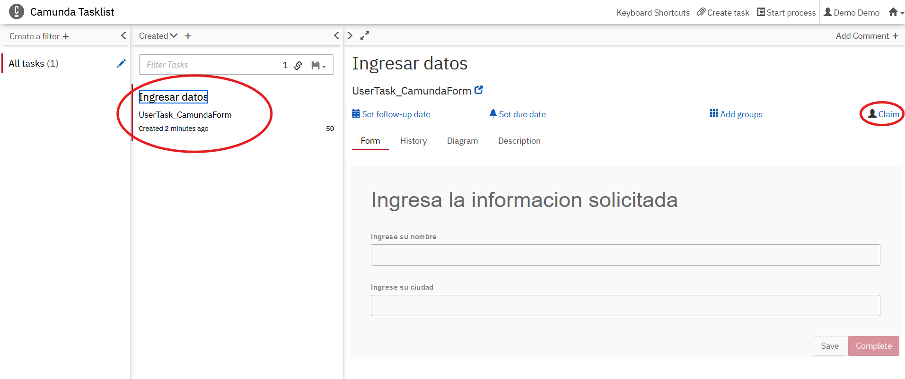

10. Finally, more than one instance of the same process can be created at the same time.
    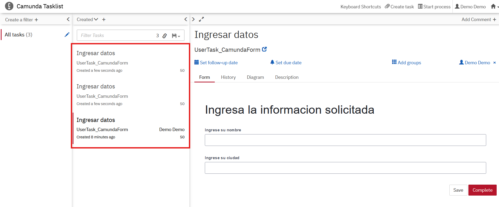